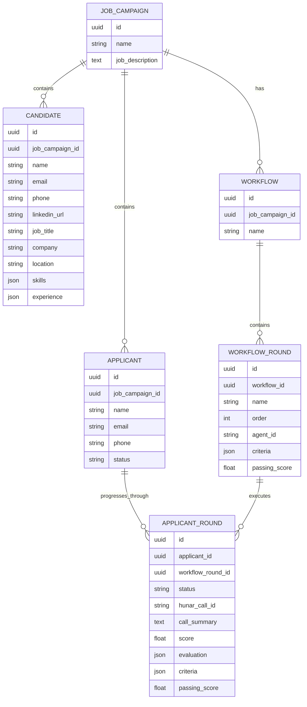

# AI Hiring & Outreach Platform

An end-to-end AI-powered recruiting platform with two core workflows:

1. **AI Hiring Assistant** — Build and execute customizable interview workflows using Voice AI agents, configurable evaluation criteria, and live hiring analytics.
2. **People Search & Outreach** — Convert a Job Description into a ranked candidate pool, automatically reach out to the best candidates using Voice AI, and monitor outreach results through a live dashboard.

---

# 1. AI Hiring Assistant

The AI Hiring Assistant allows recruiters to **build their own hiring workflow visually**, configure the AI agents used at each stage, define evaluation criteria, and start the complete interview process with a single click.

## Flow

```text
Create Hiring Workflow
          │
          ▼
     Workflow Builder
          │
          ├── Add Interview Rounds
          │
          ├── Select AI Agent
          │
          ├── Configure Agent
          │
          └── Define Evaluation Criteria
          │
          ▼
       Save Workflow
          │
          ▼
          Click "Run"
          │
          ▼
   Workflow Execution
          │
          ▼
   Candidate Interviews
          │
          ▼
      Voice AI Agent
          │
          ▼
       Webhook
          │
          ▼
    AI Evaluation
          │
          ▼
   Candidate Progression
          │
          ▼
     Live Analytics
```


# 2. People Search & Outreach

The second workflow focuses on **proactive candidate sourcing and outreach**.

Instead of waiting for applicants, the recruiter starts with a Job Description and uses people-search APIs to discover relevant candidates.

## Flow

```text
Job Description
       │
       ▼
   People Search
       │
       ▼
Candidate Profiles
       │
       ▼
     AI Ranking
       │
       ▼
Filtered + Ranked Candidates
       │
       ▼
   Voice AI Outreach
       │
       ▼
 Candidate Conversation
       │
       ▼
      Webhook
       │
       ▼
Conversation Analysis
       │
       ▼
    Live Dashboard
```

---


# 3. Data Schema

The system uses a relational model where the **Job Campaign is the central entity**.

```text

```

For the Outreach workflow:

```text

                         JobCampaign
                              │
               ┌──────────────┴──────────────┐
               │                             │
               ▼                             ▼
        Job Description                 Candidate
                                             │
                                             │
                                             ▼
                                      Outreach / Call
```

For the hiring workflow:

```text
JobCampaign
     │
     ▼
Workflow
     │
     ▼
WorkflowRound
     │
     ├── Agent Configuration
     ├── Evaluation Criteria
     ├── Passing Score
     └── Round Order
     │
     ▼
Applicant
     │
     ▼
ApplicantRound
     │
     ├── Status
     ├── Hunar Call ID
     ├── Call Summary
     ├── Score
     ├── Evaluation
     ├── Started At
     └── Completed At
```

---


# Overall Schema



---

# Two Flows, One Platform

The two workflows address different parts of the recruiting lifecycle but share the same underlying platform.

```text
                    AI RECRUITING PLATFORM
                             │
             ┌───────────────┴───────────────┐
             │                               │
             ▼                               ▼
     AI HIRING ASSISTANT              PEOPLE OUTREACH
             │                               │
             ▼                               ▼
     Workflow Builder                    Job Description
             │                               │
             ▼                               ▼
     Configure Agents                   People Search
             │                               │
             ▼                               ▼
    Configure Criteria                 AI Candidate Ranking
             │                               │
             ▼                               ▼
           RUN                         Filter Candidates
             │                               │
             ▼                               ▼
      Voice Interviews                  Voice Outreach
             │                               │
             ▼                               ▼
        AI Evaluation                    Webhook
             │                               │
             ▼                               ▼
    Candidate Progression             Conversation Analysis
             │                               │
             └───────────────┬───────────────┘
                             ▼
                     LIVE ANALYTICS
```

The core idea is to make recruiting **configurable and execution-driven**:

> **Recruiters define the workflow and criteria once, click Run, and the platform handles candidate conversations, evaluation, progression, and analytics automatically.**
